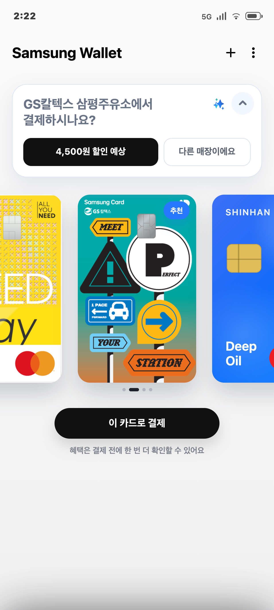
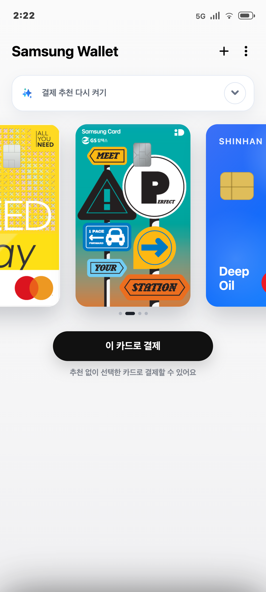
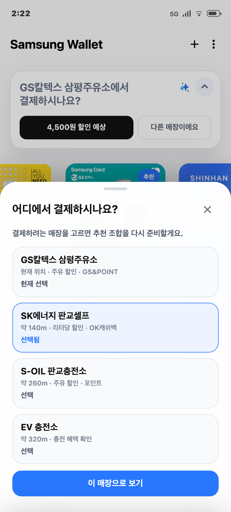
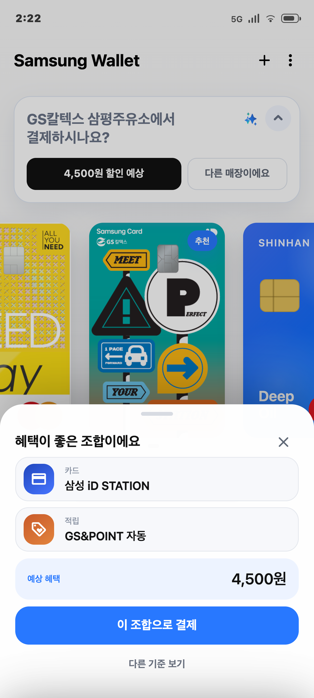
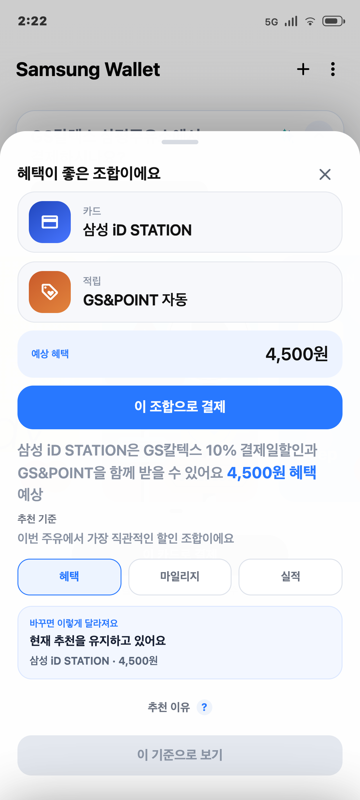
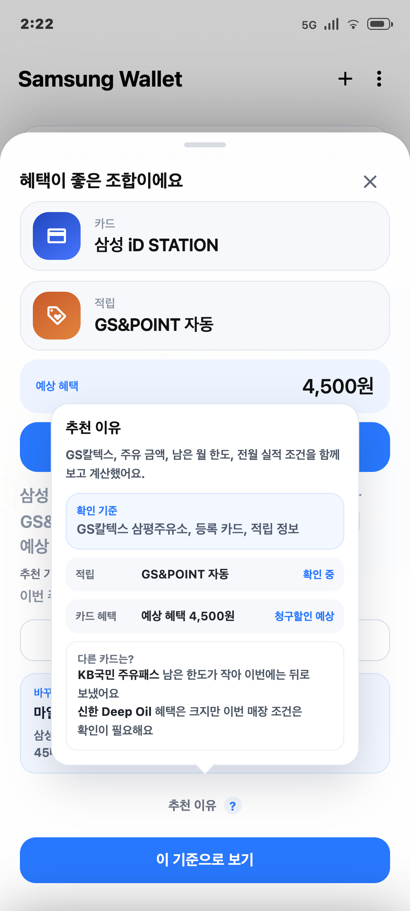
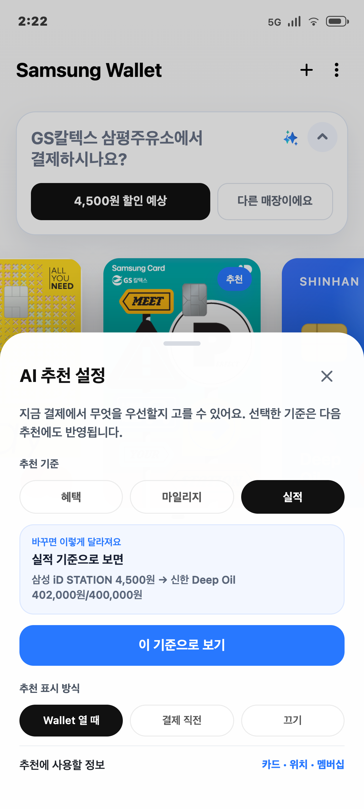
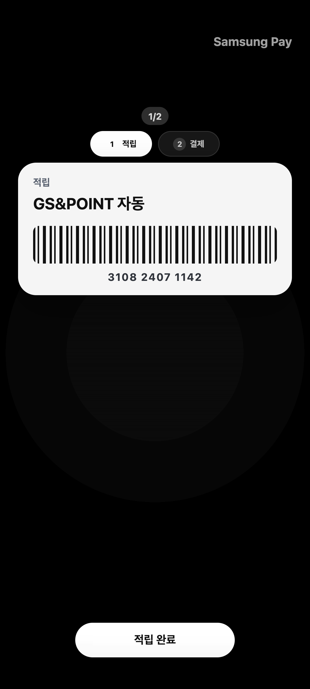
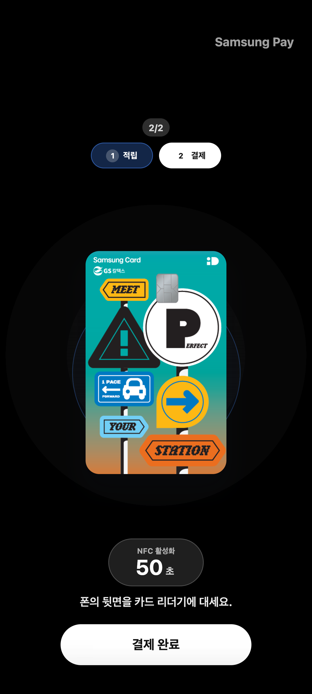
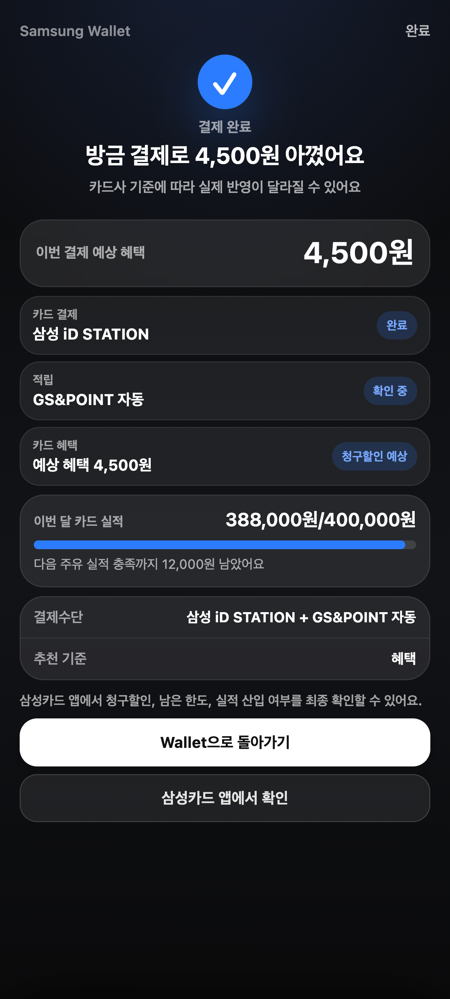

# SWAP Demo Screen Capture Guide

생성일: 2026-07-11  
캡쳐 기준: 412 x 915 모바일 viewport, device scale factor 3  
저장 위치: `demo_captures/`

## 화면 목록

| 번호 | 파일 | 화면 역할 |
| --- | --- | --- |
| 01 | `01_wallet_home_recommendation.png` | 위치 기반 결제 추천 기본 화면 |
| 02 | `02_wallet_recommendation_minimized.png` | SWAP 추천 최소화 화면 |
| 03 | `03_location_change_sheet.png` | 위치 오인식 보정 화면 |
| 04 | `04_benefit_combo_sheet.png` | 추천 혜택 조합 확인 화면 |
| 05 | `05_benefit_detail_expanded_sheet.png` | 혜택 상세보기 및 다른 기준 보기 화면 |
| 06 | `06_criteria_change_preview.png` | 다른 추천 기준 적용 전 미리보기 화면 |
| 07 | `07_settings_criteria_sheet.png` | AI 추천 기준 설정 화면 |
| 08 | `08_pay_step_membership.png` | 결제 플로우 1단계: 멤버십/적립 제시 |
| 09 | `09_pay_step_card.png` | 결제 플로우 2단계: 카드 결제 |
| 10 | `10_payment_result.png` | 결제 결과 및 혜택 확인 화면 |

## 01. 기본 Wallet 추천 화면

### 이 화면의 목적

사용자가 결제처에 도착했을 때, SWAP이 현재 위치와 등록 카드를 기반으로 가장 유리한 결제수단을 먼저 제안하는 진입 화면입니다.

### 수행 가능한 기능

- 현재 인식된 매장을 확인합니다.
- 예상 할인 CTA를 눌러 추천 조합을 확인합니다.
- 위치가 틀렸을 경우 `다른 매장이에요`로 위치 변경 화면을 엽니다.
- 추천된 카드 또는 사용자가 선택한 카드로 결제를 시작합니다.
- 우측 토글로 SWAP 추천 영역을 최소화할 수 있습니다.

### PPT용 설명 문구

결제 직전, Wallet이 현재 매장과 보유 카드를 바탕으로 예상 혜택이 가장 큰 결제수단을 먼저 제안합니다.

## 02. SWAP 추천 최소화 화면

### 이 화면의 목적

SWAP 추천을 강제로 노출하지 않고, 사용자가 일반 Wallet처럼 카드를 선택해 결제할 수 있게 하는 최소화 상태입니다.

### 수행 가능한 기능

- 추천 금액과 추천 배지를 숨깁니다.
- 선택한 카드로 일반 결제를 진행합니다.
- `결제 추천 다시 켜기`를 눌러 추천 화면을 다시 펼칩니다.

### PPT용 설명 문구

추천이 필요 없는 사용자는 SWAP을 접어두고 일반 결제 모드처럼 사용할 수 있으며, 필요할 때만 다시 켤 수 있습니다.

## 03. 위치 변경 화면

### 이 화면의 목적

위치 인식이 잘못됐거나 주변 매장 중 다른 곳에서 결제하려는 경우, 사용자가 결제 위치를 직접 수정하는 화면입니다.

### 수행 가능한 기능

- 주변 매장 후보를 확인합니다.
- 실제 결제할 매장을 선택합니다.
- `이 매장으로 보기`를 눌러 위치 변경을 적용합니다.
- 적용 전에는 추천 화면이 자동으로 닫히지 않습니다.

### PPT용 설명 문구

추천의 전제가 되는 위치가 틀렸을 때도, 사용자가 직접 매장을 고르고 추천 조합을 다시 계산할 수 있습니다.

## 04. 추천 혜택 조합 화면

### 이 화면의 목적

추천 카드 하나만 보여주는 것이 아니라, 카드와 적립 수단을 포함한 결제 조합을 한 번에 확인하는 화면입니다.

### 수행 가능한 기능

- 추천 카드와 함께 적용될 멤버십/포인트를 확인합니다.
- 예상 혜택 금액을 확인합니다.
- `이 조합으로 결제`를 눌러 단계별 결제창으로 이동합니다.
- `다른 기준 보기`를 눌러 혜택/마일리지/실적 기준을 비교합니다.

### PPT용 설명 문구

SWAP은 단순 카드 추천이 아니라, 결제 전에 적용해야 할 혜택 조합 전체를 정리해줍니다.

## 05. 혜택 상세보기 및 다른 기준 보기 화면

### 이 화면의 목적

추천 조합 바텀시트에서 `다른 기준 보기`를 눌렀을 때 열리는 확장 화면입니다. 추천 기준을 바꾸기 전에 현재 조합, 예상 혜택, 추천 기준, 기준 변경 프리뷰를 한 번에 확인할 수 있습니다.

### 수행 가능한 기능

- 추천 카드와 적립 수단을 다시 확인합니다.
- 이번 결제의 예상 혜택을 확인합니다.
- `혜택`, `마일리지`, `실적` 기준을 비교합니다.
- 기준을 바꾸면 추천 카드와 예상 혜택이 어떻게 달라지는지 미리 봅니다.
- `추천 이유`를 눌러 더 자세한 판단 근거를 확인합니다.
- `이 기준으로 보기`를 눌러 선택한 기준을 실제 추천에 적용합니다.

### PPT용 설명 문구

추천 조합을 더 자세히 보고 싶을 때는 바텀시트를 확장해, 혜택·마일리지·실적 기준별로 추천 결과가 어떻게 달라지는지 비교할 수 있습니다.

## 06. 추천 기준 변경 미리보기 화면

### 이 화면의 목적

사용자가 혜택, 마일리지, 실적 중 어떤 기준을 우선할지 바꾸기 전에 결과 변화를 먼저 확인하는 화면입니다.

### 수행 가능한 기능

- 추천 기준을 `혜택`, `마일리지`, `실적` 중에서 선택합니다.
- 기준 변경 시 카드와 예상 혜택이 어떻게 달라지는지 미리 봅니다.
- `이 기준으로 보기`를 눌러야 실제 추천에 적용됩니다.

### PPT용 설명 문구

같은 결제라도 사용자의 목적에 따라 최적 카드가 달라지므로, 적용 전에 바뀌는 결과를 먼저 보여줍니다.

## 07. AI 추천 기준 설정 화면

### 이 화면의 목적

Wallet의 더보기 메뉴에서 SWAP 추천 기준을 직접 관리하는 설정 화면입니다.

### 수행 가능한 기능

- 이번 결제에서 우선할 추천 기준을 바꿉니다.
- 기준 변경 후 예상 변화를 확인합니다.
- 추천 표시 방식을 확인합니다.
- 선택한 기준을 다음 추천에도 반영할 수 있습니다.

### PPT용 설명 문구

추천은 고정된 알고리즘이 아니라, 사용자가 중요하게 보는 기준에 맞춰 조정할 수 있습니다.

## 08. 결제 플로우 1단계: 멤버십/적립

### 이 화면의 목적

결제 전에 먼저 보여줘야 하는 멤버십, 포인트, 적립 수단을 단계적으로 제시하는 화면입니다.

### 수행 가능한 기능

- 멤버십/포인트 바코드를 제시합니다.
- 현재 결제 단계가 전체 단계 중 몇 번째인지 확인합니다.
- 완료 버튼을 눌러 다음 단계인 카드 결제로 이동합니다.

### PPT용 설명 문구

사용자는 어떤 순서로 혜택을 제시해야 하는지 기억하지 않아도, Wallet이 결제 조합을 실행 순서로 안내합니다.

## 09. 결제 플로우 2단계: 카드 결제

### 이 화면의 목적

추천된 카드로 실제 결제를 수행하는 NFC 결제 단계입니다.

### 수행 가능한 기능

- 추천 카드가 결제수단으로 활성화됩니다.
- NFC 결제 대기 상태를 확인합니다.
- 결제가 완료되면 결과 화면으로 이동합니다.

### PPT용 설명 문구

추천 조합의 마지막 단계로 카드 결제를 진행하고, 결제 결과는 다음 화면에서 혜택 단위로 정리됩니다.

## 10. 결제 결과 확인 화면

### 이 화면의 목적

결제 후 예상 혜택과 실적 변화를 정리하고, 카드사 앱에서 최종 확인할 수 있게 연결하는 화면입니다.

### 수행 가능한 기능

- 이번 결제 예상 혜택을 확인합니다.
- 카드 혜택, 적립, 실적 산입 상태를 확인합니다.
- 이번 달 실적이 얼마/얼마까지 채워졌는지 확인합니다.
- 카드사 앱으로 이동해 청구할인, 남은 한도, 실적 반영 여부를 최종 확인합니다.

### PPT용 설명 문구

결제 후에는 예상 혜택과 실적 변화를 금액으로 정리하고, 카드사 앱 확인으로 정확성을 보완합니다.

## 발표 구성 추천

1. `01_wallet_home_recommendation.png`로 서비스의 핵심 진입점을 설명합니다.
2. `02_wallet_recommendation_minimized.png`로 강제 노출이 아닌 선택 가능한 추천임을 보여줍니다.
3. `03_location_change_sheet.png`로 위치 기반 추천의 보정 흐름을 설명합니다.
4. `04_benefit_combo_sheet.png`와 `06_criteria_change_preview.png`로 SWAP의 추천 로직과 개인화 기준을 설명합니다.
5. `08_pay_step_membership.png`, `09_pay_step_card.png`, `10_payment_result.png`로 추천이 실제 결제와 결과 확인까지 이어지는 흐름을 마무리합니다.
